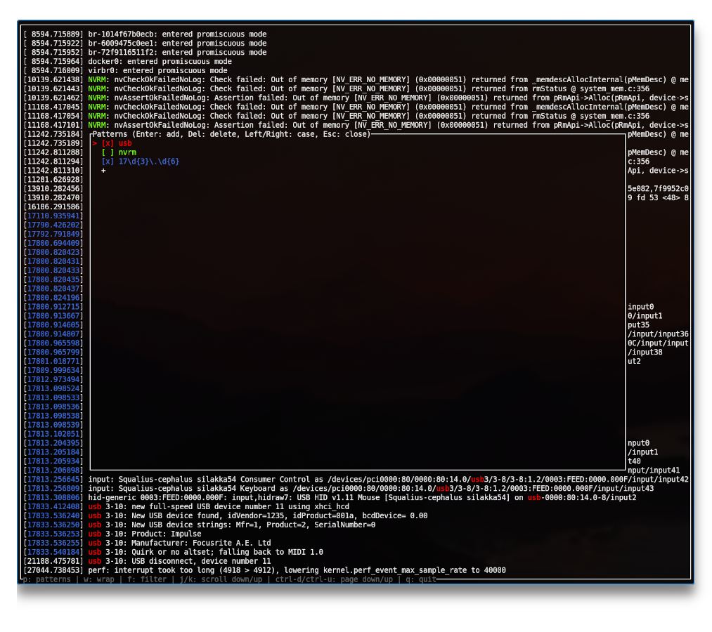

# Logr

TUI log viewer that with filtering and regex highlighting.



## Features

- Highlight multiple regex patterns with distinct colors
- Toggle per-pattern case sensitivity
- Add or delete patterns at runtime
- Toggle filter mode to show only matching lines
- Optional line wrapping

## Usage

```
Usage: logr [OPTIONS]

Options:
  -p, --patterns [<PATTERNS>...]  
  -i, --ignore-case               
  -h, --help                      Print help
  -V, --version                   Print version
```

```bash
dmesg | logr --patterns error,warning --ignore-case
```
